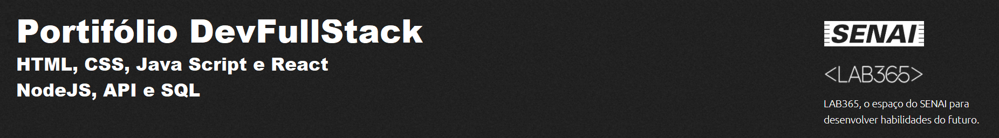

# API-Solar Energy

### Projeto de API (Back-End) para Solar Energy

#### Descrição

Desenvolvimento de um back-end para a aplicação Solar Energy. o sistema será codificado em [NodeJS], utilizando o framework [Express] e [Sequelize] com o uso do banco de dados [PostgreSQL].
Tem o objetivo de permitir que o front-end acesse via http o banco de dados para adicionar, editar, consultar e apagar conteúdos das tabelas usuários, depósitos e medicamentos. O framework Expresse foi utilizado para gestão dos paths http da aplicação e o ORM Sequelize tem o objetivo de gerenciar os acessos e construção do DataBase.
